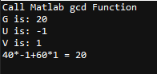
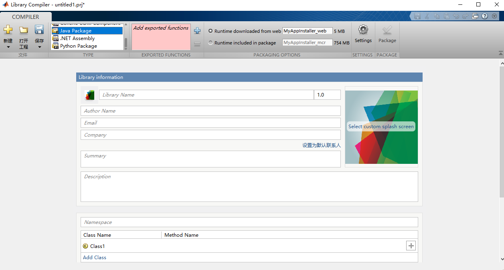
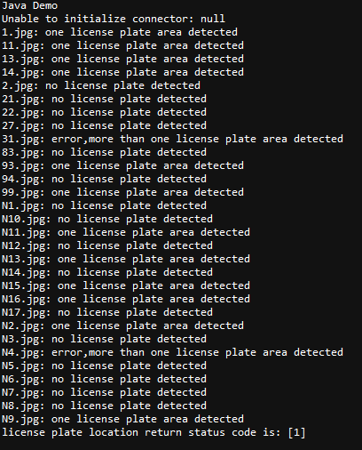

### 1 简介

在一些复杂算法的实现上，比如图形绘制和界面编辑上又十分繁琐，而Matlab在这些方面有凸显出了优势。若结合二者之长处，以Java为基础，将Matlab强大的运算能力运用起来，在处理一些问题上会方便许多。Java调用Matlab主要有两种方式，一种是调用Matlab的计算引擎，即调用Matlab本身；另一种是调用Matlab中由mcc编译生成的jart文件。

### 2 Matlab Java Engine

- 在Java中引入`engine.jar`之后可以使用Matlab引擎提供的一些常用函数，其中``engine.jar`在`MATLAB/R2018b/extern/engines/java`目录下。


- 将`MATLAB/R2018b/bin/win64`加入环境变量，该文件夹包含Matlab运行依赖的众多库文件。如果未配置，启动时会报`java.lang.UnsatisfiedLinkError: no nativemvm in java.library.path`异常，无法启动Matlab引擎。

```java
package UseEngine;
// implementation files('lib/engine.jar')
// 将 Matlab 的 Java 驱动包以本地包的形式引入项目中
import java.util.concurrent.ExecutionException;
import java.util.concurrent.RejectedExecutionException;

import com.mathworks.engine.MatlabEngine;

public class TestDemo {
    public static void main(String[] args)
            throws IllegalArgumentException, IllegalStateException, InterruptedException, RejectedExecutionException, ExecutionException {
        MatlabEngine engine = MatlabEngine.startMatlab();
		System.out.println("Call Matlab gcd Function");
		Object[] results = engine.feval(3, "gcd", 40, 60);
		Integer G = (Integer) results[0];
		Integer U = (Integer) results[1];
		Integer V = (Integer) results[2];
		
        engine.close();
		System.out.println("G is: " + G);
		System.out.println("U is: " + U);
		System.out.println("V is: " + V);
		System.out.println("40*" + U + "+60*" + V + " = " + G);
    }
}
```



### 3 Compile Matlab to Java Library

使用MCC将Matlab函数编译成jar文件，同时也会使用javabuilder将m文件转化为java源码和文档。

#### 3.1 GUI编译

Matalab提供GUI界面和命令行两种编译方式。GUI操作步骤比较繁琐，按照提示选择文件以及配置参数，然后编译即可。




#### 3.2 命令行编译

##### 3.2.1  命令简介

`mcc -W java:packageName,className options mfilename1 mfilename2...mfilenameN` creates a Java package from the specified files.

- *`packageName`* — Specifies the name of the Java package and its namespace, which is a period-separated list, such as`companyname.groupname.component`.(从指定的文件创建一个 Java 包，每一个m文件创建一个class)
- *`className`* — Specifies the name of the class to be created. If you do not specify the class name, `mcc` uses the last item in *`packageName`*.

`mcc -W java:packageName,className options class{className:mfilename1 mfilename2...mfilenameN}` creates a Java package with multiple classes from the specified files.(从指定的文件创建一个包含多个类的 Java 包，每一个m文件创建一个class)

- *`packageName`* — Specifies the name of the Java package and its namespace, which is a period-separated list, such as`companyname.groupname.component`.
- *`className`* — Specifies the name of the class to be created. If you do not specify the class name, `mcc` uses the last item in *`packageName`*.

**Compile a Java package**

```shell
#
mcc -W 'java:myMatrix,add' add.m minus.m
```

**Compile a Java package containing multiple classes**

```shell
#
mcc -W 'java:myMatrix,add' class{add:add.m} class{sub:minus.m}
```

##### 3.2.1  命令使用

- Matlab源码见[UlovHer/LicensePlateRecognition: License plate recognition and positioning, using traditional image processing algorithms. And package it into a library. (github.com)](https://github.com/UlovHer/LicensePlateRecognition)

```shell
# 编译成Jar包命令
mkdir LicensePlateLocation_Java
mcc -W 'java:LicensePlateLocation,LicensePlateLocation' license_plate_location.m plate_location_kelnel.m minboundrect.m rgb2hsi.m rectify.m detection_color.m -d LicensePlateLocation_Java
The output directory
```



#### 3.3 调用Library

- 同时也依赖`javabuilder.jar`，在`MATLAB/R2018b/toolbox/javabuilder/jar`目录下。
- JDK需和Matlab中的JDK版本一致。


```java
package UseJar;

import java.util.ArrayList;
import java.util.Arrays;
import java.util.List;

import LicensePlateLocation.LicensePlateLocation;

public class TestDemo {
	public static void main(String[] args) throws Exception {
		String detect_folder = "./data/test_dataset/plate_set1/";
		String output_folder = "./data/test_dataset/detect_result/";
		String suffix = "*.jpg";
		int status_code = 0;

		System.out.println("Java Jar Demo");
		// 构造license_plate_location的输入输出参数,参数类型参照编译完成的文档
		// doc文件夹内的文档对LicensePlateLocation类有详细的说明
		LicensePlateLocation liLicensePlateLocation = new LicensePlateLocation();
		List<String> inputs = new ArrayList<String>(Arrays.asList(detect_folder, suffix, output_folder));

		List<Integer> results = new ArrayList<Integer>();
		results.add(status_code);
		liLicensePlateLocation.license_plate_location(results, inputs);

		System.out.println("license plate location return status code is: " + results);
	}
}

```

